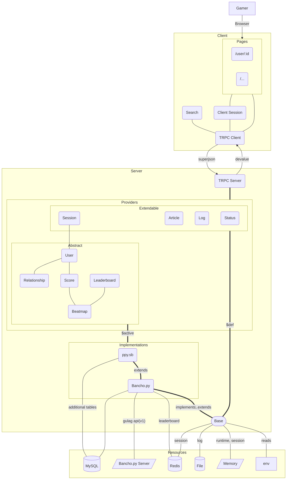

# Guccho

## Overview

Guccho is a web-based service designed for interacting with private osu! servers, focusing on compatibility and ease of use.

## System Requirements

- Node.js version 18 or higher.
- A compatible platform (details on supported platforms provided below).

## Installation and Setup

- Configuration preparation is crucial:

  - Generate `guccho.ui.ts` based on `guccho.ui.example.ts`.
  - Create `guccho.backend.ts` using `guccho.backend.example.ts` as a template.
  - Edit the newly created configuration files as guided by the included comments.
  - If using `env()` or `safeEnv()`, set up a `.env` file using `.env.example` as a reference.

- Install dependencies:
  ```bash
  pnpm install
  ```

## Tooling

For use with `bancho.py` or `ppy.sb@bancho.py`, ensure `DB_DSN` is set in your environment variables to enable Prisma/Drizzle tooling.

## Supported Backends

- **bancho.py (also known as gulag)**
- **ppy.sb**

## Production Deployment

- To build the application for production:

  ```bash
  pnpm build
  ```

- To start the production server:

  ```bash
  pnpm start:prod
  ```

- Further details on deployment can be found in the [Nuxt.js deployment documentation](https://v3.nuxtjs.org/guide/deploy/presets).

## Development Environment

- Launch the development server at <http://localhost:3000>:
  ```bash
  pnpm dev
  ```

### Upcoming Features (To-Dos)

- Implement functionality to grant owner privileges to the first registered user.

## Architecture Diagram



## The team (Guccho)

- [ppy.sb](https://github.com/ppy-sb)
- Guccho
