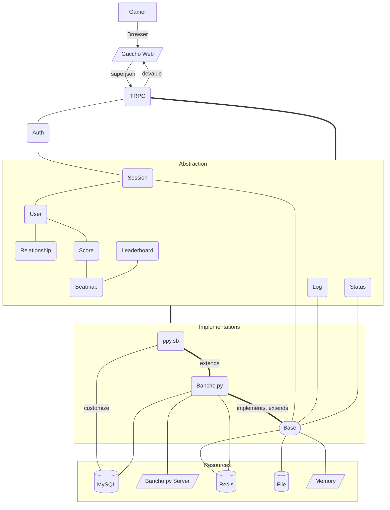

# Guccho

## What is Guccho?

Guccho is a web interface to interact with osu private servers with compatibility in mind.

## Requirements

- Nodejs >= 14
- at least one supported platform (see supporting platforms down below)

## Setup

- Config .env *important*
create .env from .env.example.

- Run `yarn`
- Run `yarn build:hljs`

## upgrade

```sh
yarn && yarn build:all
```

## backends

- ### bancho.py (aka gulag)

- ### ppy.sb

  Run `yarn build:schemas`

## Development Server

Start the development server on <http://localhost:3000>

```bash
yarn dev
```

## Production

Build the application for production:

```bash
# yarn
yarn build
```

Locally preview production build:

```bash
# yarn
yarn preview:dev # or yarn preview:prod
```

Start Production server

```bash
# yarn
yarn start:prod
```

Checkout the [deployment documentation](https://v3.nuxtjs.org/guide/deploy/presets) for more information.

### todo(s)

TODO Give first registered user owner privilege

## AppConfig

see `src/app.config.ts`



## The team (Guccho)

- [ppy.sb](https://github.com/ppy-sb)
- [Varkaria](https://github.com/Varkaria)
